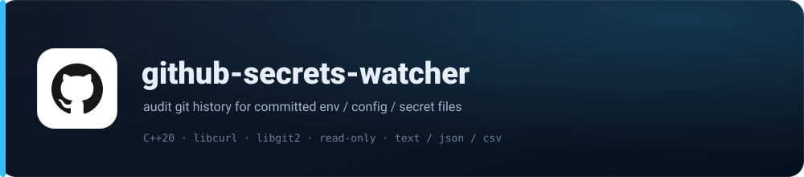
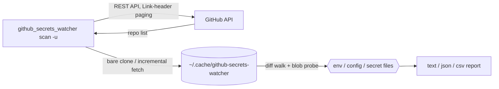

<p align="center">
  <picture>
    
  </picture>
</p>

<p align="center"><strong>A read-only CLI that audits GitHub repository history for accidentally committed environment and secret files.</strong></p>

<p align="center">
  
  
  
  
  
  
</p>

<p align="center">
  
  
  
  
  
</p>

<p align="center">
  
</p>

---

## 🚀 What it does

Scans public (and, with a token, private) repositories for a given GitHub user and walks the Git history across branches looking for `.env` files, configuration files, and anything named like a secret — then reports exact commit links, read-only, without touching the repositories.

- **Environment & config detection** — flags `.env`, `config`, `settings`, and `secrets` path names across the full history.
- **Direct commit links** — every finding links to the exact commit where the file existed (URL-encoded, hash-validated).
- **Content-aware confidence** — files whose contents look like real credentials (AWS/GitHub/Stripe tokens, JWTs, private keys, non-placeholder `key=` / `token=` / `secret=` / `password=` assignments) are ranked above name-only flags.
- **Multi-threaded** — parallel repository scanning with configurable thread count.
- **Persistent clone cache** — full history is cloned once and reused; repeat scans fetch only new commits (default `~/.cache/github-secrets-watcher`).
- **Text / JSON / CSV output**, colored terminal, `--dry-run`, `--yes` for CI, pagination via the GitHub `Link` header, real error causes (rate limit vs. bad token), and rate-limit warnings.
- **Millisecond `--verbose` timestamps** with per-phase durations (clone/fetch vs. history walk) and an end-of-run timing summary.
- **Modest system footprint** — modern C++20, stream-based processing, low memory.

## 🧭 How it works



For each repository the tool builds a **bare clone** and walks history from the newest reachable tip (across all branches) back towards the root:

1. **Tip seeding** — files present in the newest commit are immediately credited to that commit, so a file deleted yesterday is attributed correctly. Excluded directories (`node_modules`, `build`, `vendor`, …) are pruned from the walk entirely.
2. **Diff walk** — every commit is compared to its first parent (an empty tree at the root). Added/modified files are credited to the commit that introduced them; **deleted** files are credited to the parent commit, so reported links always point at a commit where the file actually existed. The cost grows with changed paths, not `depth × repository size`.
3. **Content probe** — each reported file's bytes at that commit are checked against secret-shaped patterns and flagged `likely_secret` when they match.
4. **Early exit (opt-in)** — `--early-exit N` stops a full-history walk after `N` consecutive commits with no new findings.
5. **Depth limit** — `-d N` examines at most `N` commits using a shallow fetch, so bounded scans stay small.

**What gets skipped by design:** test/spec files (`config.test.js`, `settings.spec.ts`), schema files (`.env.schema` — the value-less shape), build artifacts (`*.lock`, `*.min.js`, `*.d.ts`, `*.map`), media/fonts (`.png`, `.svg`, `.woff2`, …), and docs/templates (`.md`, `.txt`, `.example`, …). `.js`/`.json` config files (e.g. `vite.config.js`, `settings.json`) are still reported — they often hold API keys.

## 🛠 Build & test

Requires a C++20 compiler, libcurl, libgit2 (1.9+), and [nlohmann/json](https://github.com/nlohmann/json) (vendored as `src/json.hpp` — no install needed).

| Platform | Install the dependencies |
|---|---|
| Ubuntu / Debian | `sudo apt-get install build-essential cmake pkg-config libcurl4-openssl-dev libgit2-dev catch2` |
| CentOS / RHEL | `sudo yum groupinstall "Development Tools" && sudo yum install cmake pkgconfig libcurl-devel libgit2-devel catch2` |
| macOS (Homebrew) | `brew install cmake pkg-config curl libgit2 catch2` |
| Windows (MSYS2) | `pacman -S mingw-w64-x86_64-toolchain mingw-w64-x86_64-cmake mingw-w64-x86_64-pkgconf mingw-w64-x86_64-curl mingw-w64-x86_64-libgit2 mingw-w64-x86_64-catch` |

> Windows is exercised by the CI workflow on every push/PR (`windows-latest` + MSYS2).

### CMake (recommended)

```bash
cmake -B build -DBUILD_TESTING=ON
cmake --build build --parallel
ctest --test-dir build --output-on-failure
# executable: build/github_secrets_watcher
```

### Build scripts

`build/build.sh` (Linux/macOS/WSL/MSYS2/Termux) and `build/build.bat` (Windows) are **functional twins**: both locate `cmake` / `pkg-config` / the compiler with `command -v` (Unix) or `where.exe` (Windows), prefer CMake, and fall back to a direct `g++` compile whose library flags come from `pkg-config`. When `where`/`command -v` can't find a tool they guess a few well-known directories.

```bash
chmod +x build.sh && ./build.sh   # CMake path; direct g++ fallback
```

```cmd
build.bat
```

### Manual compilation

```bash
g++ -std=c++20 -Wall -Wextra -pthread -Isrc \
    src/main.cpp src/github.cpp src/scanner.cpp src/utils.cpp \
    $(pkg-config --cflags --libs libcurl libgit2) \
    -o github_secrets_watcher
```

## ⌨️ Usage

```bash
# basic public scan
./build/github_secrets_watcher scan -u YOUR_USERNAME

# with a token (higher rate limits + private repos)
./build/github_secrets_watcher scan -u YOUR_USERNAME -t YOUR_PAT

# private repos, 4 threads, JSON report to a file, no prompt
./build/github_secrets_watcher scan -u YOUR_USERNAME -t YOUR_PAT -p -n 4 -f json -o results.json -y

# preview without scanning
./build/github_secrets_watcher scan -u YOUR_USERNAME --dry-run

# one repo only
./build/github_secrets_watcher scan -u YOUR_USERNAME -r repo-name
```

| Option | Description |
|---|---|
| `-u, --username <USER>` | GitHub username (required) |
| `-t, --token <TOKEN>` | Personal access token (private repos, higher rate limits) |
| `-p, --include-private` | Include private repositories (requires token) |
| `-d, --depth <NUM>` | Commits to scan (default `0` = all history) |
| `-m, --max-repos <NUM>` | Maximum repositories to scan |
| `-n, --threads <NUM>` | Worker threads (default: hardware concurrency) |
| `-r, --repo <NAME>` | Scan only this repository |
| `-R, --repos <A,B,C>` | Scan only this comma-separated list |
| `-f, --format <FMT>` | `text`, `json`, or `csv` (default: `text`) |
| `-o, --output <FILE>` | Write report to file (default: stdout) |
| `-v, --verbose` | Per-repo progress with millisecond timestamps + timing summary |
| `--cache <DIR>` | Clone cache directory (default `~/.cache/github-secrets-watcher`) |
| `--no-cache` | Always clone fresh into a temporary directory |
| `--early-exit <N>` | Stop a full-history walk after `N` quiet commits (opt-in) |
| `--no-early-exit` | Disable the early-exit heuristic explicitly |
| `--dry-run` | List repositories that would be scanned |
| `-y, --yes` | Skip the confirmation prompt (scripts/CI) |

**Progressive feedback:** without `--verbose` a live progress indicator is shown (`[14:30:22] Progress: 5/20 repositories (25%)`). With `--verbose` each repository logs its phases and durations:

```
[14:30:22.123] Scanning: repository-name
[14:30:22.398] [INFO] Ready to scan (cache) in 275.0 ms
[14:30:22.398] [INFO] Scanning history...
[14:30:22.614] [WARN] Found 3 potential environment/configuration files:
...
[INFO] Timing: GitHub API 48.5 ms | clone/fetch total 1.36 s | history scan total 610 ms | wall 0.99 s
```

### Output formats

`text` (default), `json` (machine-friendly, includes scan stats), and `csv` (RFC 4180-safe):

```text
Repository: CareConnect-Clinic-Appointment-System
  Status: Success
  Found 6 potential environment/configuration files:
    - client/vite.config.js
      [LINK] https://github.com/Gerald-1234/CareConnect-Clinic-Appointment-System/blob/1008a4e37c20daa635b148a2094a9966263c6fd0/client%2fvite.config.js
```

```json
[{
  "repo_name": "StudySync",
  "html_url": "https://github.com/Gerald-1234/StudySync",
  "success": true,
  "files": [
    {"path": "client/assets/js/config.js", "commit_hash": "6c6d6a7d...", "likely_secret": false}
  ],
  "scan": {"commits_considered": 14, "commits_skipped": 1, "stopped_early": false, "truncated_by_depth": false}
}]
```

```csv
repo_name,success,error_message,file_path,commit_hash,likely_secret
StudySync,true,,client/assets/js/config.js,6c6d6a7d...,false
```

## 📊 Performance & trade-offs

Benchmarked on Ubuntu (cmake 4.2.3, g++ 15.2.0, libgit2 1.9.1) scanning 3 small repositories with 4 threads:

| Scenario | Wall time | Peak RSS |
|---|---|---|
| Bounded `-d 100`, cold (fresh shallow clone per repo) | 1.27 s | ~42.5 MB |
| Full history, cold (`--no-cache`, fresh bare clone per repo) | 1.50 s | ~34.8 MB |
| Full history, warm (incremental fetch via cache) | 0.39 s | ~35.4 MB |

Repeat scans are about **3× faster** because a cached run only downloads commits pushed since the last scan.

Deliberate trade-offs, in the order they affect you:

- **`--early-exit` is opt-in (off by default).** A security scan should be exhaustive. It only applies to `-d 0` scans.
- **`-d N` (bounded) scans always clone fresh** — libgit2 cannot reliably deepen a shallow clone; no risk of stale results, just less reuse.
- **The clone cache costs disk space.** Delete the cache directory to start over; it is only read/written on your machine.
- **Files are skipped by "cannot be a secret" heuristics.** A secret stored in, say, `config.png` would not be reported; config files themselves are still reported by design.
- **Merge commits are walked along the first parent only** (like `git log`).
- **Deleted files are credited to the parent commit**, so links always point at commits where the file existed.

## 🔧 Troubleshooting

| Symptom | Fix |
|---|---|
| `undefined reference to git_*` at link time | Missing `-lgit2` (and usually `-pthread`) — use the `pkg-config libgit2` flags as shown in the manual compile command. |
| `Fail: GitHub user not found` | Username is case-sensitive / renamed / typo'd. |
| `GitHub API returned HTTP 403 - rate limit exceeded` | Out of API calls. Supply `--token` to raise the limit. |
| `HTTP 403 - Bad credentials` / `Resource not accessible by personal access token` | Token missing, expired, or lacks `repo` scope. Regenerate with the full `repo` scope. |
| `Git clone failed: authentication failed` (`--include-private`) | Token missing/expired/lacks `repo` scope. The token is never embedded in the clone URL. |
| `CMake Error: Could not find ... "Catch2"` | Install Catch2, or configure with `-DBUILD_TESTING=OFF`. |

## 📁 Repository layout

```
.
├── CMakeLists.txt          # pkg-config for libcurl/libgit2, Catch2 for tests
├── build/
│   ├── build.sh            # Unix/macOS/WSL/MSYS2/Termux build script
│   └── build.bat           # Windows build script (functional twin of build.sh)
├── assets/
│   └── banner.svg          # README banner
├── src/
│   ├── main.cpp            # CLI entry point, output formats, timing
│   ├── github.cpp/hpp      # GitHub REST API client (Link-header pagination)
│   ├── scanner.cpp/hpp     # git history scanner (libgit2, pruned tip walk)
│   ├── thread_pool.hpp     # parallel worker pool
│   ├── utils.cpp/hpp       # URL/CSV helpers, link parsing
│   └── json.hpp            # vendored nlohmann/json (single header)
└── tests/
    ├── utils.test.cpp      # helpers + CSV/Link-header parsing
    └── scanner.test.cpp    # integration-style tests against a real git repo
```

## 🛡 Safety

- Only scan repositories you own or have explicit permission to scan.
- The tool is read-only: it never modifies repositories.
- Intended for defensive security awareness and learning.
- Your token is never embedded in clone URLs or printed in logs.

## 📄 License

MIT — see [LICENSE](LICENSE).